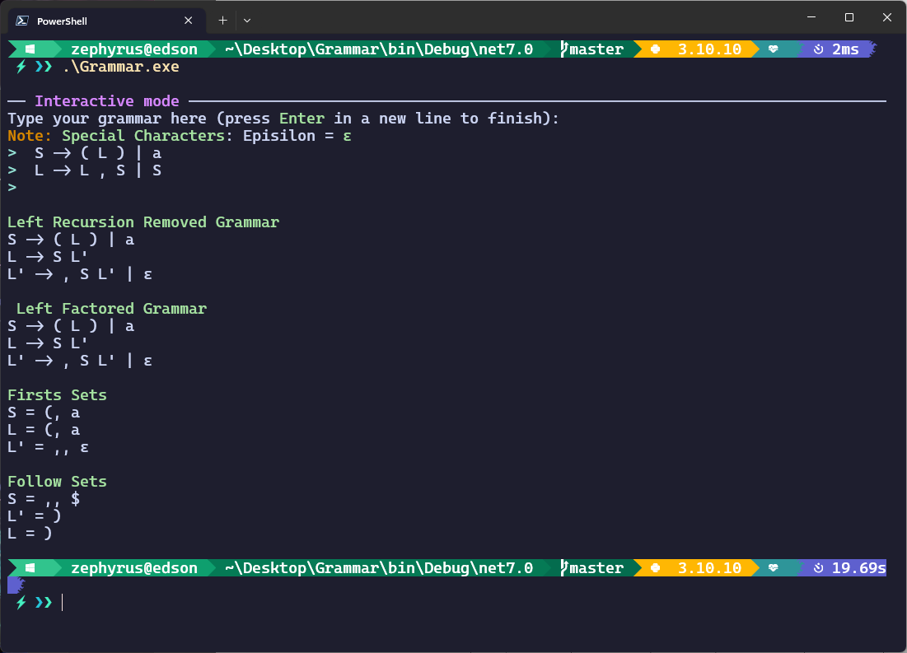
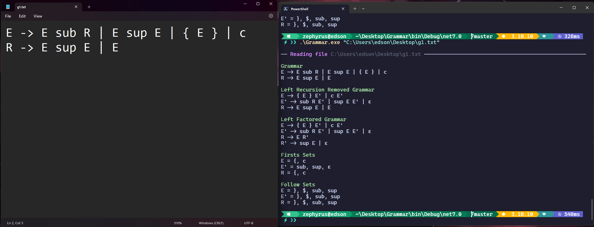

# Grammar

## Descripcion
Un programa que recibe una gramatica libre de contexto y
1. Determina y elimina la recursividad a la izquierda
2. Realiz factorizacion a la izquierda, si es posible

```
cd bin\Debug\net7.0
.\Grammar.exe <ruta-al-archivo>
```

O puede compilar el proyecto con el siguiente comando:
```bash
dotnet run -- <ruta-al-archivo> # Para ejecutarlo, el -- es necesario para que el compilador no tome como un argumento propio
dotnet build # Para compilarlo, crea la carpeta bin\Debug\net7.0
```

Si no se coloca una ruta se activara el modo interactivo, en el cual se puede escribir cada parte de la gramatica.

Es importante que el archivo de entrada tenga el siguiente formato:
```
S -> a A
A -> b A
A -> c
```
Los espacios son importantes, ya que el programa los utiliza para separar los elementos de la gramatica.
Es posible que el programa no funcione correctamente si no se sigue el formato.

Tambien es posible agregar más de una produccion por linea, con el simbolo `|`:
```
S -> a A | b B
A -> c
B -> d
```

## Ejemplos

### Modo interactivo


### Archivo de entrada
